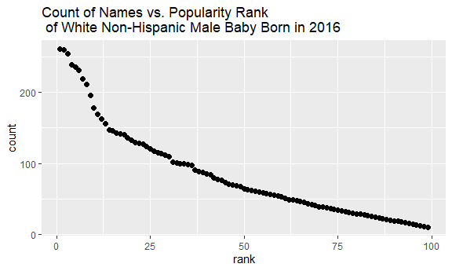

P8105 HW2 xc2610
================

# Livraries required for codes below

``` r
library(tidyverse)
```

    ## -- Attaching packages --------------------------------------- tidyverse 1.3.1 --

    ## v ggplot2 3.3.5     v purrr   0.3.4
    ## v tibble  3.1.4     v dplyr   1.0.7
    ## v tidyr   1.1.3     v stringr 1.4.0
    ## v readr   2.0.1     v forcats 0.5.1

    ## -- Conflicts ------------------------------------------ tidyverse_conflicts() --
    ## x dplyr::filter() masks stats::filter()
    ## x dplyr::lag()    masks stats::lag()

``` r
library(ggridges)
library(readxl)

knitr::opts_chunk$set(
  fig.width = 6,
  fig.asp =.6,
  out.width= "90%")
```

# Problem 1

Clean the data of Mr. Trash Wheel

``` r
## Read the Mr. Trash Wheel sheet from the excel file
trash_data = read_excel("./data/Trash-Wheel-Collection-Totals-7-2020-2.xlsx", sheet = 1)
```

    ## New names:
    ## * `` -> ...15
    ## * `` -> ...16
    ## * `` -> ...17

``` r
#show(trash_data)
#names(trash_data)

## clean the variable names
trash_data = janitor::clean_names(trash_data)

#names(trash_data)

## drop rows not for particular dumpster
trash_data <- drop_na(trash_data, dumpster)
trash_data <- filter(trash_data, dumpster != 'Grand Total')

#view(trash_data)

## round the number of sports balls to integer
trash_data <- mutate(trash_data,
  sports_balls_rounded = round(sports_balls)
)

## cleaned data
view (trash_data)
```

Clean the data of precipitations in 2018 and 2019

``` r
## read the precipitations in 2018
precipitation_2018 = read_excel("./data/Trash-Wheel-Collection-Totals-7-2020-2.xlsx", sheet = '2018 Precipitation')
```

    ## New names:
    ## * `` -> ...2

``` r
#show(precipitation_2018)

## modify the data frame with appropriate variable name, necessary rows
precipitation_2018 <- precipitation_2018[2:13,]
colnames(precipitation_2018) <- c('month','total')

## add years variable
precipitation_2018 <- mutate(precipitation_2018,
  year = 2018
)
#view(precipitation_2018)

## read the precipitations in 2019
precipitation_2019 = read_excel("./data/Trash-Wheel-Collection-Totals-7-2020-2.xlsx", sheet = '2019 Precipitation')
```

    ## New names:
    ## * `` -> ...2

``` r
#show(precipitation_2019)

## modify the data frame with appropriate variable name, necessary rows
precipitation_2019 <- precipitation_2019[2:13,]
colnames(precipitation_2019) <- c('month','total')

## add years variable
precipitation_2019 <- mutate(precipitation_2019,
  year = 2019
)
#view(precipitation_2019)
```

Merge two data frames together

``` r
precipitation_data = rbind(precipitation_2018, precipitation_2019)
#view(precipitation_data)

## convert variables type
precipitation_data <- transform(precipitation_data, total = as.numeric(total))
precipitation_data <- transform(precipitation_data, month = as.numeric(month))
precipitation_data <- mutate(precipitation_data,
  month = month.name[month]
)

## cleaned data
view(precipitation_data)
```

The trash data contains 444 rows and 18 columns, each row shows data of
a dumpster collected at some certain date (dumpster No., years, month
and date are four of the columns, and the rest of columns describes the
content in the dumpsters). The number of contents are rounded to some
reasonable values, for example you can see “2200” “3300” for cigarette
butts instead of some super precise value. As for the precipitation
data, we have precipitation of each month in 2018 and 2019. It’s easy to
observe that there are more precipitation in 2018 compare to 2019.

The total precipitation of 2018 is 70.33 in. The median of sports balls
found in dumpsters in 2019 is 9.

``` r
print(with(precipitation_data, sum(total[year == 2018])))
```

    ## [1] 70.33

``` r
print(with(trash_data, median(sports_balls[year == 2019])))
```

    ## [1] 9

# Problem 2

Load data

``` r
## read the pols data
pols_data = read_csv("./data/fivethirtyeight_datasets/pols-month.csv")
```

    ## Rows: 822 Columns: 9

    ## -- Column specification --------------------------------------------------------
    ## Delimiter: ","
    ## dbl  (8): prez_gop, gov_gop, sen_gop, rep_gop, prez_dem, gov_dem, sen_dem, r...
    ## date (1): mon

    ## 
    ## i Use `spec()` to retrieve the full column specification for this data.
    ## i Specify the column types or set `show_col_types = FALSE` to quiet this message.

``` r
## Sepertate the date to three different variables
pols_data <- pols_data %>% 
  separate(mon, into = c("year", "month", "day"), convert = TRUE)
#view(pols_data)
```

clean the pols data

``` r
## rename month with month names
pols_data <- mutate(pols_data, month = month.name[month])

## replace prez_gop and prez_dem variables with one president variable
pols_data <- mutate(pols_data,
  president = ifelse(prez_gop == 1, "gop", "dem")
)

## drop the day variable
pols_data <- select(pols_data, -c(day, prez_gop, prez_dem))
#view(pols_data)
```

clean the snp data

``` r
## read the snp data
snp_data = read_csv("./data/fivethirtyeight_datasets/snp.csv")
```

    ## Rows: 787 Columns: 2

    ## -- Column specification --------------------------------------------------------
    ## Delimiter: ","
    ## chr (1): date
    ## dbl (1): close

    ## 
    ## i Use `spec()` to retrieve the full column specification for this data.
    ## i Specify the column types or set `show_col_types = FALSE` to quiet this message.

``` r
## Sepertate the date to three different variables and arrange to proper order
snp_data <- snp_data %>% 
  separate(date, into = c("day", "month", "year"), convert = TRUE)
snp_data <- snp_data[, c("year", "month", "day", "close")] 
snp_data <- snp_data[ with(snp_data, order(year, month)),]

## rename month with month names
snp_data <- mutate(snp_data, month = month.name[month])

## cleaned data
view(snp_data)
```

clean the unemployment data

``` r
## read the unemployment data
unemploy_data = read_csv("./data/fivethirtyeight_datasets/unemployment.csv")
```

    ## Rows: 68 Columns: 13

    ## -- Column specification --------------------------------------------------------
    ## Delimiter: ","
    ## dbl (13): Year, Jan, Feb, Mar, Apr, May, Jun, Jul, Aug, Sep, Oct, Nov, Dec

    ## 
    ## i Use `spec()` to retrieve the full column specification for this data.
    ## i Specify the column types or set `show_col_types = FALSE` to quiet this message.

``` r
## separate the wide table according to each month, add month as a new variable and give the old unemployment values a name "Num"
df1 = unemploy_data[,c("Year", "Jan")]
df1 <- mutate(df1, month = month.name[1])
df1 <- rename(df1, Num = Jan)
df2 = unemploy_data[,c("Year", "Feb")]
df2 <- mutate(df2, month = month.name[2])
df2 <-rename(df2, Num = Feb)
df3 = unemploy_data[,c("Year", "Mar")]
df3 <- mutate(df3, month = month.name[3])
df3 <- rename(df3, Num = Mar)
df4 = unemploy_data[,c("Year", "Apr")]
df4 <- mutate(df4, month = month.name[4])
df4 <- rename(df4, Num = Apr)
df5 = unemploy_data[,c("Year", "May")]
df5 <- mutate(df5, month = month.name[5])
df5 <- rename(df5, Num = May)
df6 = unemploy_data[,c("Year", "Jun")]
df6 <- mutate(df6, month = month.name[6])
df6 <- rename(df6, Num = Jun)
df7 = unemploy_data[,c("Year", "Jul")]
df7 <- mutate(df7, month = month.name[7])
df7 <- rename(df7, Num = Jul)
df8 = unemploy_data[,c("Year", "Aug")]
df8 <- mutate(df8, month = month.name[8])
df8 <- rename(df8, Num = Aug)
df9 = unemploy_data[,c("Year", "Sep")]
df9 <- mutate(df9, month = month.name[9])
df9 <- rename(df9, Num = Sep)
df10 = unemploy_data[,c("Year", "Oct")]
df10 <- mutate(df10, month = month.name[10])
df10 <- rename(df10, Num = Oct)
df11 = unemploy_data[,c("Year", "Nov")]
df11 <- mutate(df11, month = month.name[11])
df11 <- rename(df11, Num = Nov)
df12 = unemploy_data[,c("Year", "Dec")]
df12 <- mutate(df12, month = month.name[12])
df12 <- rename(df12, Num = Dec)

## Merge the small data sets of each month
unemploy_data <- Reduce(function(x, y) merge(x, y, all=TRUE), list(df1, df2, df3, df4, df5, df6, df7, df8, df9, df10, df11, df12))
unemploy_data <- rename(unemploy_data, year = Year)

## cleaned data
view(unemploy_data)
```

Merge three data frame together

``` r
## Merge three data frame together
data_538 = merge(pols_data, snp_data)
data_538 = merge(data_538, unemploy_data)

## cleaned data of three datasets
view(data_538)
```

The pols data contains number of democratic or republican that are
president, governors, senators and representatives over time; The snp
data contains Standard & Poor’s stock market index closing values over
time; the unemployment data contains percentage of unemployment over
time. By tidying these three datasets together, we may analyze the
relationship within the government status, S&P index and unemployment
percentage over time. The final data frame have 787 rows, 12 columns.
Among them, three columns are time (year, month and day(might not be
accurate)) from 1950 Feb to 2015 Jan, seven columns of political
variables, one column for S&P and one column for unemployment
percentage.

# Problem 3

``` r
baby_name_data = read_csv("./data/Popular_Baby_Names.csv")
```

    ## Rows: 19418 Columns: 6

    ## -- Column specification --------------------------------------------------------
    ## Delimiter: ","
    ## chr (3): Gender, Ethnicity, Child's First Name
    ## dbl (3): Year of Birth, Count, Rank

    ## 
    ## i Use `spec()` to retrieve the full column specification for this data.
    ## i Specify the column types or set `show_col_types = FALSE` to quiet this message.

``` r
baby_name_data = janitor::clean_names(baby_name_data)
names(baby_name_data)
```

    ## [1] "year_of_birth"     "gender"            "ethnicity"        
    ## [4] "childs_first_name" "count"             "rank"

``` r
# skimr::skim(baby_name_data)
# Eth <- unique(baby_name_data$Ethnicity)
baby_name_data <- mutate(baby_name_data,
  ethnicity = ifelse(ethnicity == "ASIAN AND PACI", "ASIAN AND PACIFIC ISLANDER", ethnicity)
)
baby_name_data <- mutate(baby_name_data,
  ethnicity = ifelse(ethnicity == "BLACK NON HISP", "BLACK NON HISPANIC", ethnicity)
)
baby_name_data <- mutate(baby_name_data,
  ethnicity = ifelse(ethnicity == "WHITE NON HISP", "WHITE NON HISPANIC" , ethnicity)
)

baby_name_data <- mutate(baby_name_data,
                         childs_first_name = tolower(childs_first_name))

baby_name_data <- distinct(baby_name_data)
```

``` r
olivia_name_data <- baby_name_data %>%
  filter(childs_first_name == 'olivia')

olivia_table <- olivia_name_data[, c('year_of_birth', 'ethnicity', 'rank')]

pivot_wider(olivia_table, names_from = year_of_birth, values_from = rank)
```

    ## # A tibble: 4 x 7
    ##   ethnicity                  `2016` `2015` `2014` `2013` `2012` `2011`
    ##   <chr>                       <dbl>  <dbl>  <dbl>  <dbl>  <dbl>  <dbl>
    ## 1 ASIAN AND PACIFIC ISLANDER      1      1      1      3      3      4
    ## 2 BLACK NON HISPANIC              8      4      8      6      8     10
    ## 3 HISPANIC                       13     16     16     22     22     18
    ## 4 WHITE NON HISPANIC              1      1      1      1      4      2

``` r
male_name_data <- baby_name_data %>%
  filter(gender == 'MALE', rank == 1)

male_popular_table <- male_name_data[, c('year_of_birth', 'ethnicity', 'childs_first_name')]

pivot_wider(male_popular_table, names_from = year_of_birth, values_from = childs_first_name)
```

    ## # A tibble: 4 x 7
    ##   ethnicity                  `2016` `2015` `2014` `2013` `2012` `2011` 
    ##   <chr>                      <chr>  <chr>  <chr>  <chr>  <chr>  <chr>  
    ## 1 ASIAN AND PACIFIC ISLANDER ethan  jayden jayden jayden ryan   ethan  
    ## 2 BLACK NON HISPANIC         noah   noah   ethan  ethan  jayden jayden 
    ## 3 HISPANIC                   liam   liam   liam   jayden jayden jayden 
    ## 4 WHITE NON HISPANIC         joseph david  joseph david  joseph michael

``` r
tb3_data <- baby_name_data %>%
  filter(gender == 'MALE', ethnicity == 'WHITE NON HISPANIC', year_of_birth == 2016)

ggplot(tb3_data, aes(x=rank, y=count)) +
  geom_point(size=2, shape=16)
```


